# MAKEFILE
---
- Build Process cơ bản hệ thống nhúng
- Compiler GCC
- Khái niệm cơ bản Makefile
- Viết makefile cho 1 project Vi điều khiển
- Tổng quát hóa Makefile cho các project khác nhau

Document: Makefile GNU
https://www.gnu.org/software/make/

<details>
  <summary><h3>Lesson 1: Build Process  </h3></summary>

## I. Build Process Bassic
> Quá trình để file source.c .h build ra file nhị phân nạp xuống VDK

Quá trình build process-bassic: cho code thông thường
- Preprocessor:  
    + include file header vào file.c -> file expand đuôi.i
    + Comment bị xóa, macro bị thay thế bằng define tương ứng
- Compilation:
    + Đầu vào là file.i được tạo ra ở trên
    + Đầu ra là file mã máy asembly đuôi.s
- Asemble:
    + Lấy file.s lắp ghép lại tạo file object .o
    + file.o đã là file nhị phân rồi, nhưng chưa đầy đủ
- Linking:
    + Liên kết toàn bộ file.o với file static library(.lib/.a) - thư viện liên kết tĩnh -> build ra file.exe (Executable file)

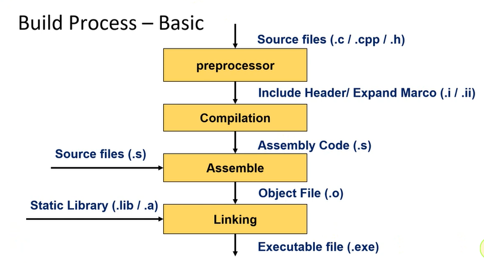


## II. Build process embedded (video 2)
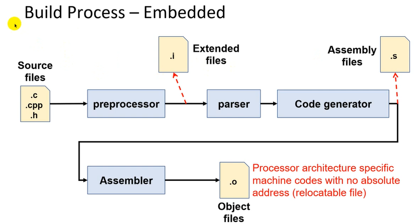

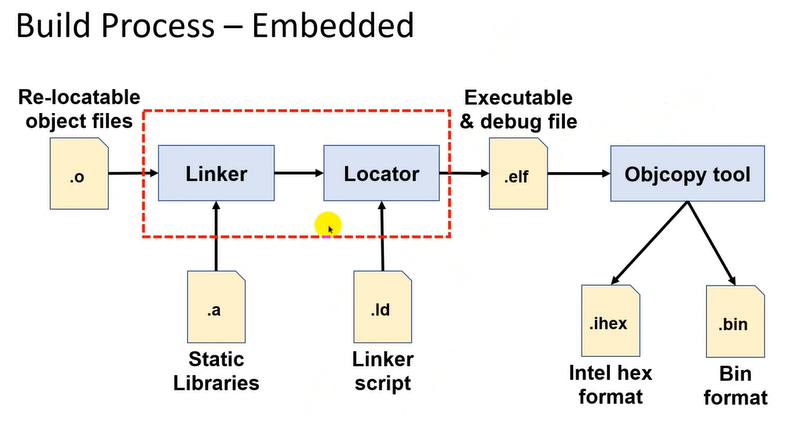


- Build process 1: preprocessor, compilation, assemble to buil object file (.o)
- Build process 2: Linking (object file-.o & static library-.a)  (*)
- Build process 3: (*) & Locator(linker script-.ld) to build Executable & debug file(.elf)	
- Build process finally: (.elf) -> Object_copy_tool -> .ihex & .bin

</details>

<details>
  <summary><h3>Lesson 2: GCC-Command Line</h3></summary>

## I. GCC- Command Line
- Trình biên dịch GCC
- Command Line cơ bản và sử dụng GCC với build process
- Makefile - Lí do cần sử dụng Makefile

### 1. Trình biên dịch GCC
>`Compiler`(trình biên dịch) là một chương trình máy tính làm nhiệm vụ dịch các câu lệnh viết bằng NNLT -> thành chương trình tương dương viết dưới dạng NNMT.

GCC là gì? 
- GCC (GNU Compiler Collection): tập hợp các trình biên dịch được thiết kế cho nhiều NNLT khác nhau
- GCC là thành phần quan trọng của GNU toolchain (toolchain - là tập hợp các tool từ file source code -> build ra file thực thi cuối cùng cho VDK)

Các GCC: Dev C++/CodeBlock, MingW, Cygwin
Cài MingW, Cygwin (Pakage: gcc, make)

https://www.youtube.com/watch?v=1rdh1D1v1Ss&list=PLj4nUuq8YFDEcR8DhC4K0oEVOErlkU5Vt&index=3 

### 2. Command Line
- `gcc --version`: Kiểm tra GCC version 
- `mkdir <folder_name>`: Tạo folder mới
- Mở command line ở ổ đĩa khác, vào đúng đường dẫn của folder đó. Thanh tìm kiếm nhập `cmd`.
- `ls`: Xem các file con bên trong
- `cd <folder_name>`: Nhảy đến folder đó VD: cd Makefile/hello
- `cd..`: Quay lại folder trước đó
- `touch <file_name>`: Tạo 1 file mới
- `./`: Thư mục hiện tại
- `/`: Truy xuất folder con
- `..`: Ra khỏi folder mẹ
- `rm ./<folder_name>/<file_name>`: Xóa file
- `rm ./<folder_name>/*`: Xóa hết tất cả file trong đấy
- `rm ./<folder_name>/*.o`: Xóa hết tất cả file.o trong đấy

Command Line build process
- Preprocessor `gcc -E main.c -o main.i`
- Compilation `gcc -S main.i -o main.s`
- Assemble `as main.s -o main.o `
- Linking `gcc -v -o main main.o` (`gcc [option] -o <output_file> <input_file>`)

--> Run: `main.exe` hoặc `main`

Có thể thay thế 3 quá trình preprocessor, compilation, assemble bằng
`gcc -c main.c -o main.o`
</details>

<details>
  <summary><h3>Lesson 3: Makefile bassic</h3></summary>

## I. Chương trình makefile đơn giản

> Tại sao dùng makefile, tạo ra 1 makefile đơn giản?

VD: Cho chương trình tính tổng a + b, gồm 3 file main.c sum.c sum.h

--> Để Run chương trình bằng command line phải thực hiện build process: preprocessor, compilation, asemble, linking

Sơ đồ luồng build process
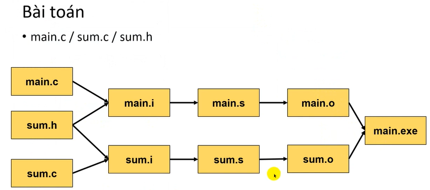

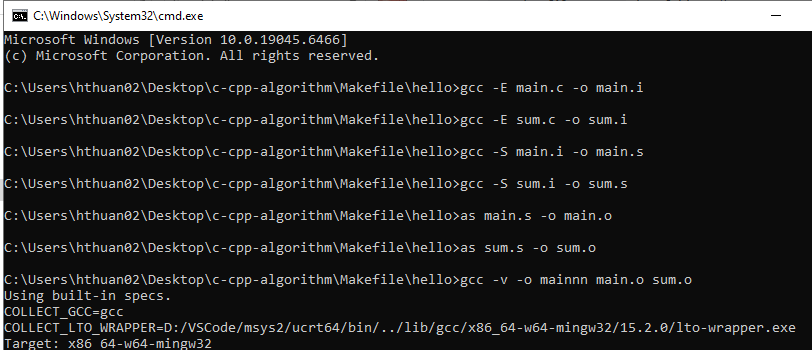

Qua 8 dòng lệnh mới run được chương trình 
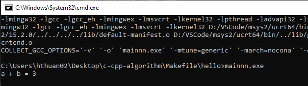

> Makefile là dạng script file(file kịch bản) để build tất cả câu lệnh gcc, đích đến là tạo ra file đuôi exe
> Khi muốn thêm 1 new_file.c mới vào project thì phải rebuild lại toàn bộ rất mất thời gian. Makefile giúp build lại đúng file đó không phải build lại từ đầu.

*file-script: Là file không có đuôi gì cả.
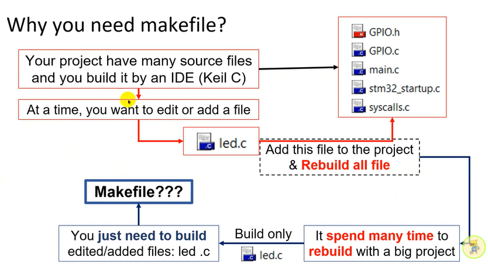

```c
// Makefile is a script file format that contains some information: 
//  - Project structure (file, dependencies): Câu trúc project (file.c file.h), Các phụ thuộc file.c .h là include các file header.
//  - Commands to create files (object file, elf/bin/hex files, …): Bao gồm các câu lệnh gcc tạo ra các file .i .s .o
//  - The make command will read makefile content, understand project’s structure and execute the commands: Các câu lệnh make để đọc nội dung makefile -> hiểu nội dung project, bao gồm những file nào, cấu trúc folder như nào. Cuối cùng build ra file nhị phân
// VD:
// src
//  |
//  file1.c
//  file2.c...      
// header...
// ... 
//
// Tools for Makefile: Cygwin/Mingw/GNU Make 
```

**Tạo 1 makefile đơn giản**
```c
all:
    gcc -E main.c -o main.i
    gcc -S main.i -o main.s
    as main.s -o main.o 
    gcc -E sum.c -o sum.i
    gcc -S sum.i -o sum.s
    as sum.s -o sum.o 
    gcc -v -o main main.o sum.o 
run:
    ./main.exe
```
## II. Cấu trúc của 1 makefile
### 1. Rules makefile
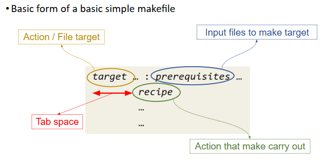

- `target`: Tên ở đầu ra có 2 cách viết

như `all:`, `run:`, `build:` 
```c
all:
   gcc....
run 
   ./main.exe
```
hoặc viết tên file đầu ra `main.i:` (ngay sau dấu 2 chấm, phải viết tên đầu vào `prerequisites`)

```c
main.o: main.c
    gcc....
run 
    ./main.exe
```

Bên dưới phải có `tab`.
- `recipe`: Hành động thực thi

    - Đối với chương trình c/c++ bình thường: 
    `gcc -c <input_files> -o <output_file>` ->`gcc -c main.c -o main.o`


    - Đối với mcu:
    `GCC -o <output_files> <input_file>` -> `GCC -o Output/main.o User/src/main.c`

- `GCC` khác với `gcc`
    - `gcc`: Trình biên dịch của máy tính MingW, Cygwin,...
    - `GCC`: GNU-Toolchain (ARM for embedded)


### 2. Example makefile
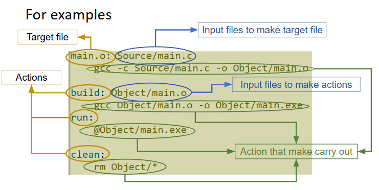

Việc tạo object file(main.o) có thể tạo luôn từ file.c không cần trải qua 3 quá trình build process: proprocessor, compilation, assemble.
```c
main.o: main.c
	gcc -E main.c -o main.i
	gcc -S main.i -o main.s
	as main.s -o main.o 
```
thành
```c
main.o: src/main.c
    gcc -c src/main.c -o src/main.o
```

```c
# Tạo object file, rút ngắn quá trình preprocessor,compile,assemble
main.o: main.c
	gcc -c main.c -o main.o
sum.o: sum.c
	gcc -c sum.c -o sum.o 
	
# Linking	
build: main.o sum.o
	gcc main.o sum.o -o main.exe
run:
	./main.exe
```
- Tạo action `build`: trong cmd gõ `make build`, không cần `make main.o` hay `make sum.o`

### 3. Bố trí folder file cho makefile
Thường tất cả file nằm chung 1 folder rất lộn xộn -> bố trí folder cho từng file
- `src`: file source (file.c)
- `inc`: file include, thường là header (file.h)
- `out`: cho cái (file.i .s .o)

Khi Run chương trình thì cd từ vị trí makefile

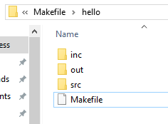

- Thêm `src/`, ban đầu ở `Makefile` -> nhảy đến folder con `main.c` -> src/main.c. Tương tự với `out/`

```c
# Tạo object file, rút ngắn quá trình preprocessor,compile,assemble
out/main.o: src/main.c
	gcc -c -I./inc src/main.c -o out/main.o

# `-I` câu lệnh gcc hỗ trợ tìm đến file.h mà nó cần để liên kết file header
# dấu `.` là đang đứng ở đây, sau đó chui vào `inc`

out/sum.o: src/sum.c
	gcc -c -I./inc src/sum.c -o out/sum.o 
	
# Linking	
build: out/main.o out/sum.o
	gcc out/main.o out/sum.o -o out/main.exe
run:
	./out/main.exe
```
</details>

<details>
  <summary><h3>Lesson 4: Rules in makefile </h3></summary>

## I. PHONY keyword
Giả sử tên `action` trong makefile giống với `<file_name>`
> `.PHONY` là từ khóa phân biệt cái nào là action, nào nào <file name>

```c
.PHONY: build
build: main.o sum.o
    gcc main.o sum.o -o main.exe
...
```
- `build` là action không bị nhầm lẫn với <file_name> là build

## II. Variable in makefile
> Giống đặt tên trong macro, tên biến không có kiểu dữ liệu.

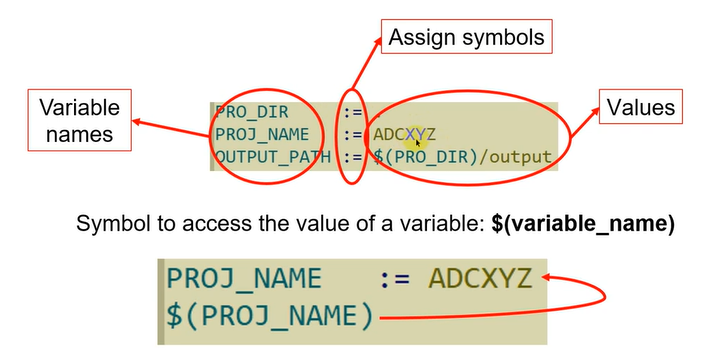

- Giả sử đặt tên biến là `PROJ_NAME = sum`, chỗ nào là `sum` thì thay thế bằng `PROJ_NAME` (giống thay thế trong macro).
- Để thay thế được cần kí tự `$` để truy cập

### Dấu `=`, giá trị được gán ngay lập tức 

```c
PROJ_NAME := sum

out/main.o: src/main.c
	gcc -c -I./inc src/main.c -o out/main.o
	
out/$(PROJ_NAME).o: src/$(PROJ_NAME).c
	gcc -c -I./inc src/$(PROJ_NAME).c -o out/$(PROJ_NAME).o

.PHONY: build
build: out/main.o out/$(PROJ_NAME).o
	gcc out/main.o out/$(PROJ_NAME).o -o out/main.exe
```
### `=`, giá trị được tính lại (kết hợp với `+=`)

### `+=` sử dụng như nối chuỗi, + thêm nhiều giá trị 

```c
PROJ_NAME := sum
OBJ_FILES = out/main.o 
OBJ_FIELS += out/$(PROJ_NAME).o

out/main.o: src/main.c
	gcc -c -I./inc src/main.c -o out/main.o

out/$(PROJ_NAME).o: src/$(PROJ_NAME).c
	gcc -c -I./inc src/$(PROJ_NAME).c -o out/$(PROJ_NAME).o 
	
.PHONY: build
build: $(OBJ_FILES)
	gcc out/main.o out/$(PROJ_NAME).o -o out/main.exe

```
### III. Print value of variables
> Sử dụng từ khóa `echo` để print

- `@`: để dòng lệnh đó không hiển thị ra
- `@echo`: để in ra dòng lệnh tùy chỉnh


```c
PROJ_NAME := sum
OBJ_FILES = out/main.o
OBJ_FILES += out/$(PROJ_NAME).o

out/main.o: src/main.c
	@gcc -c -I./inc src/main.c -o out/main.o

out/$(PROJ_NAME).o: src/$(PROJ_NAME).c
	@gcc -c -I./inc src/$(PROJ_NAME).c -o out/$(PROJ_NAME).o 
	
.PHONY: build
build: $(OBJ_FILES)
	@gcc out/main.o out/$(PROJ_NAME).o -o out/main.exe
	@echo "Build Done!"

.PHONY: run
run:
	./out/main.exe
	
clean:
	@rm ./out/*.o
	@echo "Clear ALL Output files!"
```

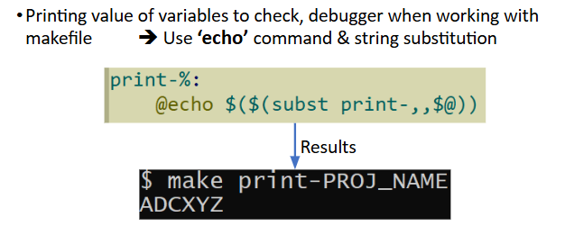

```
print-%:
	@echo $($(subst print-,,$@))
```
- Nhập "make print-PROJ_NAME"
- `,,` giữa 2 dấu phẩy chưa có gì cả (khoảng trống chứa giá trị xuất ra chứ k phải 2 dấu phẩy là format gì). 
- Tiếp theo là truy xuất `$`, của `@` là của `PROJ_NAME`
`@echo $($(subst print-,,$@))` -> `@echo $(PROJ_NAME)`

</details>

<details>
  <summary><h3>Lesson 5: Makefile with MicroController 1 (build file.o & file.elf)  </h3></summary>

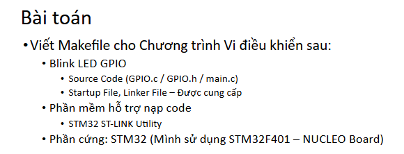

- Install: GNU-Toolchain
https://developer.arm.com/downloads/-/gnu-rm

Kiểm tra trong cmd: `arm-none-eabi-gcc --version`

- Install STM32 ST-Link Unity
https://www.st.com/en/development-tools/stsw-link004.html

## I. Bố trí folder
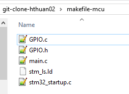


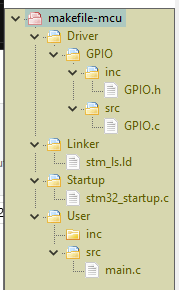

- Sơ đồ build process mcu

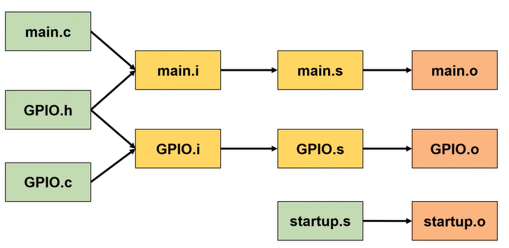


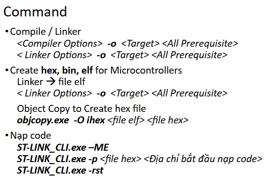

## II. Bước đầu viết makefile 

> Tìm `arm-none-eabi-gcc` trong file cài, lấy đường dẫn cho GCC

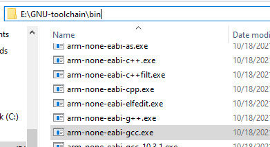


Tạo 3 object file: main.o, GPIO.o, startup.o

- `recipe`: Giai đoạn tạo action makefile-mcu khác với makefile-bassic. Tạo 3 file.o từ 3 file.c: main.c, GPIO.c, startup.c

- `GCC` khác với `gcc`
    - `gcc`: Trình biên dịch của máy tính MingW, Cygwin,...
    - `GCC`: GNU-Toolchain (ARM for embedded)

```c
GCC_DIR := E:/GNU-toolchain/
CC = $(GCC_DIR)/bin/arm-none-eabi-gcc

#main.o
Output/main.o: User/src/main.c
	$(CC) -o Output/main.o User/src/main.c
    #<Linker_Option>
#GPIO.o
Output/GPIO.o: Driver/GPIO/src/GPIO.c
	$(CC) -o Output/GPIO.o Driver/GPIO/src/GPIO.c
    #<Linker_Option> 
#startup.o
Output/stm32_startup.o: Startup/stm32_startup.c
	$(CC) -o Output/stm32_startup.o Startup/stm32_startup.c	
    #<Linker_Option>
```

## III. Compiler Options & Linker Options of ARM GCC
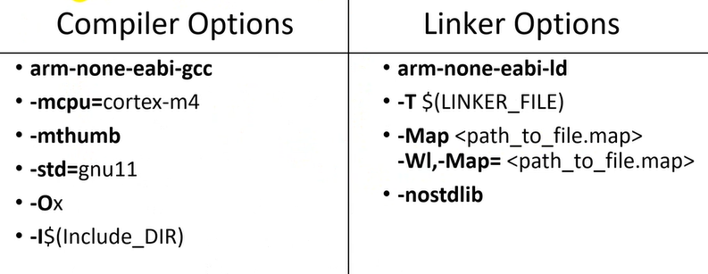

Thành phần trong Compiler Options có thể gọi là options hoặc flags
-> Tạo file.o

- `arm-none-eabi-gcc`: Trình biên dịch (gcc for ARM chips)
- `-mcpu=cortex-m4`: options chỉ định core của MCU đang sử dụng
VD: STM32F103T8C6 (Bluepill) -> `-mcpu=cortex-m3`
- `-mthumb`: MCU sử dụng tập lệnh thumb hay arm 
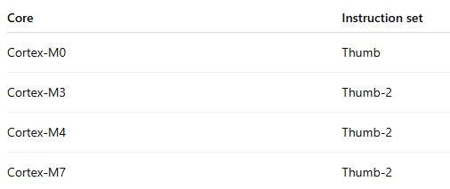
- `-std=gnu11`: thư viện std
- `-Ox`: options cho optimize
- `-I$(Include_DIR)`: quét các header file

Linker Options -> tạo file.elf 
- `arm-none-eabi-gcc`:linker options tương ứng với Compiler Options, sẽ có 1 file này trong folder mình tải về
- `-T<back_space>$(LINKER_FILE)`: options dùng để tìm linker script file
- `-Map <path_to_file.map>`: đến đường dẫn file.map, file.map-bản đồ bộ nhớ 
  `-Wl,-Map= <path_to_file_map>`
- `nostdlib`: no std llib, không sử dụng các thư viện tiêu chuẩn

#### "compiler options arm gcc" -> mở rộng thêm
### 1. Tạo compiler options (.o)
```c
GCC_DIR := E:/GNU-toolchain/
CC=$(GCC_DIR)/bin/arm-none-eabi-gcc
LD_FILE := Linker/stm_ls.ld
INC_DIR := Driver/GPIO/inc

CHIP = cortex-m3

# Compiler Options: gọi tắt là comile flags
CCFLAGS= -c -mcpu=$(CHIP) -mthumb -std=gnu11 -O0 -I$()
# -c để cho compile
# -O0 không dùng Optimize
# -I$() quét header file

# Linker flags
LDFLAGS= -nostdlib -T $(LD_FILE) -Wl,-Map=GPIO.map
```
- Thêm compiler options trước `-o`

```c
.PHONY: build
build: Output/main.o Output/GPIO.o Output/stm32_startup.o

#main.o
Output/main.o: User/src/main.c
	$(CC) $(CCFLAGS) -o Output/main.o User/src/main.c
#GPIO.o
Output/GPIO.o: Driver/GPIO/src/GPIO.c
	$(CC) $(CCFLAGS) -o Output/GPIO.o Driver/GPIO/src/GPIO.c 
#startup.o
Output/stm32_startup.o: Startup/stm32_startup.c
	$(CC) $(CCFLAGS) -o Output/stm32_startup.o Startup/stm32_startup.c
```

### Compile Options hoàn chỉnh -> file.o
```c
GCC_DIR := E:/GNU-toolchain/
CC=$(GCC_DIR)/bin/arm-none-eabi-gcc
LD_FILE := Linker/stm_ls.ld
INC_DIR := Driver/GPIO/inc

CHIP = cortex-m3

# Compiler Options: gọi tắt là comile flags
CCFLAGS= -c -mcpu=$(CHIP) -mthumb -std=gnu11 -O0 -I$(INC_DIR)
# -c để cho compile
# O0 không dùng Optimize

# Linker flags
LDFLAGS= -nostdlib -T $(LD_FILE) -Wl,-Map=GPIO.map 

.PHONY: build
build: Output/main.o Output/GPIO.o Output/stm32_startup.o

#main.o
Output/main.o: User/src/main.c
	$(CC) $(CCFLAGS) -o Output/main.o User/src/main.c
#GPIO.o
Output/GPIO.o: Driver/GPIO/src/GPIO.c
	$(CC) $(CCFLAGS) -o Output/GPIO.o Driver/GPIO/src/GPIO.c 
#startup.o
Output/stm32_startup.o: Startup/stm32_startup.c
	$(CC) $(CCFLAGS) -o Output/stm32_startup.o Startup/stm32_startup.c
```
### 2. Tạo Linker options (.elf)


```c
#GPIO.elf
Output/GPIO.elf: Output/main.o Output/GPIO.o Output/stm32_startup.o
	$(CC) $(LDFLAGS) -o Output/GPIO.elf Output/main.o Output/GPIO.o Output/stm32_startup.o
```

- Đặt đường dẫn file.map trong linker options  "Output/.."

### Hoàn chỉnh compiler options & linker options
```c
GCC_DIR := E:/GNU-toolchain/
CC=$(GCC_DIR)/bin/arm-none-eabi-gcc
LD_FILE := Linker/stm_ls.ld
INC_DIR := Driver/GPIO/inc

CHIP = cortex-m3

# Compiler Options: gọi tắt là comile flags
CCFLAGS= -c -mcpu=$(CHIP) -mthumb -std=gnu11 -O0 -I$(INC_DIR)
# -c để cho compile
# O0 không dùng Optimize

# Linker flags
LDFLAGS= -nostdlib -T $(LD_FILE) -Wl,-Map=Output/GPIO.map 

.PHONY: build
build: Output/GPIO.elf

#main.o
Output/main.o: User/src/main.c
	$(CC) $(CCFLAGS) -o Output/main.o User/src/main.c
#GPIO.o
Output/GPIO.o: Driver/GPIO/src/GPIO.c
	$(CC) $(CCFLAGS) -o Output/GPIO.o Driver/GPIO/src/GPIO.c 
#startup.o
Output/stm32_startup.o: Startup/stm32_startup.c
	$(CC) $(CCFLAGS) -o Output/stm32_startup.o Startup/stm32_startup.c
	
#GPIO.elf
Output/GPIO.elf: Output/main.o Output/GPIO.o Output/stm32_startup.o
	$(CC) $(LDFLAGS) -o Output/GPIO.elf Output/main.o Output/GPIO.o Output/stm32_startup.o
```

 
Tiếp theo:
- Nạp file.elf -> MCU: Debug
- Tạo ra file.ihex/.bin -> MCU: RUN

</details>


<details>
  <summary><h3>Lesson 6: Makefile with MicroController 2 (Build file hex/.bin & flash firmware)  </h3></summary>

_(Lesson 5 continue)_

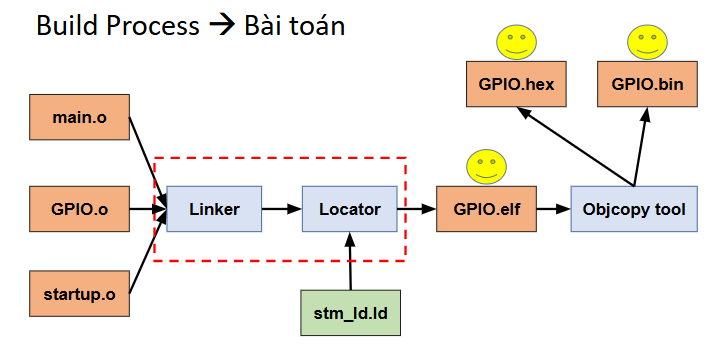
Nội dung: Từ file.elf build ra file.hex/.bin nạp xuống MCU (thông qua bộ Object Copy Tool)


## I. Object Copy Tool (build file.hex)
> Trong ARM GCC có cung cấp file `objcopy.exe`, tìm đường dẫn trong file cài GNU-Toolchain

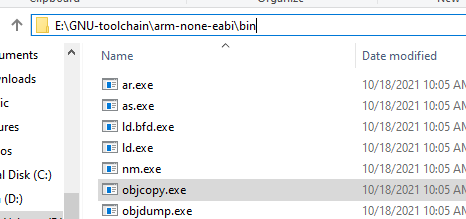

```
#GPIO.hex
Output/GPIO.hex: Output/GPIO.elf
	$(GCC_DIR)/arm-none-eabi/bin/objcopy.exe -O ihex "Output/GPIO.elf" "Output/GPIO.hex"

#(GCC_DIR):  Đường dẫn cũ kết hợp với /arm-none..... -> đường dẫn của objcopy.exe
```
### Hoàn chỉnh tạo file.o, file.elf và file.hex (file.map là của linker options)
```c
GCC_DIR := E:/GNU-toolchain/
CC=$(GCC_DIR)/bin/arm-none-eabi-gcc
LD_FILE := Linker/stm_ls.ld
INC_DIR := Driver/GPIO/inc


CHIP = cortex-m3

# Compiler Options: gọi tắt là comile flags
CCFLAGS= -c -mcpu=$(CHIP) -mthumb -std=gnu11 -O0 -I$(INC_DIR)
# -c để cho compile
# O0 không dùng Optimize

# Linker flags
LDFLAGS= -nostdlib -T $(LD_FILE) -Wl,-Map=Output/GPIO.map 

.PHONY: build
build: Output/GPIO.hex

#main.o
Output/main.o: User/src/main.c
	$(CC) $(CCFLAGS) -o Output/main.o User/src/main.c
#GPIO.o
Output/GPIO.o: Driver/GPIO/src/GPIO.c
	$(CC) $(CCFLAGS) -o Output/GPIO.o Driver/GPIO/src/GPIO.c 
#startup.o
Output/stm32_startup.o: Startup/stm32_startup.c
	$(CC) $(CCFLAGS) -o Output/stm32_startup.o Startup/stm32_startup.c
	
#GPIO.elf
Output/GPIO.elf: Output/main.o Output/GPIO.o Output/stm32_startup.o
	$(CC) $(LDFLAGS) -o Output/GPIO.elf Output/main.o Output/GPIO.o Output/stm32_startup.o

#GPIO.hex
Output/GPIO.hex: Output/GPIO.elf
	$(GCC_DIR)/arm-none-eabi/bin/objcopy.exe -O ihex "Output/GPIO.elf" "Output/GPIO.hex"


.PHONY: clean
clean:
	rm -rf ./Output/*
```

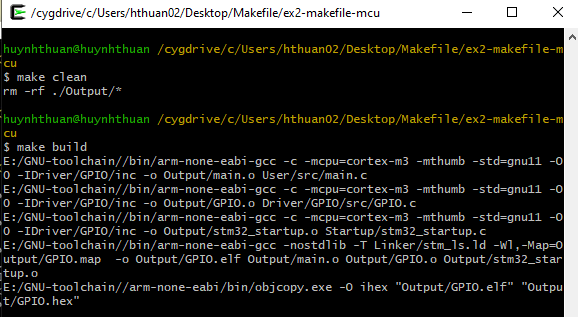

## II. Download/Flash firmware(.hex) into MCU
_(CLI: Command Line Interface)_
CLI: Giao diện dòng lệnh, thay vì nạp code qua GUI của IDE. Thì ở đây dùng Tool CLI 

> Ở quá trình trên từ source file build file.hex đã đi 90% code makefile, 10% còn lại là flash firmware vào chip.
>
> Flash firmware là flash file.hex vào chip. Việc flash này phụ thuộc vào tool (ST-Link-Unility, OpenOCD, STM32CubeProgrammer,...)
>
> Để cá nhân hóa việc cập nhật firmware, có thể tự xây dựng `bootloader` riêng. Khi đó firmware được cập nhật thông qua bootloader (UART/USB/CAN/WIFI/OTA...) thay vì phụ thuộc trực tiếp vào ST-Link hay STM32CubeProgrammer.

- Flash bằng ST-Link-Unility --> Fail....
```c
run: 
	./Tools/st-link-unity/ST-LINK_CLI.exe -ME
	./Tools/st-link-unity/ST-LINK_CLI.exe -p "Output/GPIO.hex" 0x08000000
	./Tools/st-link-unity/ST-LINK_CLI.exe -rst
```

- Flash bằng STM32CubeProgrammer --> Success!!!

```c
PROGRAMMER := E:/STM32CubeProgrammer/stm32cube_down_firmware/bin/STM32_Programmer_CLI.exe
...
...
...
.PHONY: run
run: 
	$(PROGRAMMER) -c port=SWD -e all
#Xóa toàn bộ flash cũ
	$(PROGRAMMER) -c port=SWD -w Output/GPIO.hex 0x08000000 -rst
#Nạp firmware từ địa chỉ ban đầu, reset MCU trước khi chạy code mới
```
- `-c`: Connect

- `port=SWD`: Chọn giao thức để debug (gồm SWD, JTAG, UART, SPI, I2C, CAN)
*SWD = Serial Wire Debug: Là giao thức debug phổ biến nhất của STM32, chỉ cần SWCLK, SWDIO, GND

- `-e all`: Erase toàn bộ flash trước khi nạp. Tránh firmware cũ còn sót lại, lỗi verify, crash cho dữ liệu cũ

- `-w`: Nạp firmware, ghi vào flash

- `-rst`: Reset MCU, chạy code mới

- `-r32 addr size`: Đọc memory 
VD:
`STM32_Programmer_CLI.exe -c port=SWD -r32 0x20000000 4`

- `-d file.bin addr`: Dumb memory

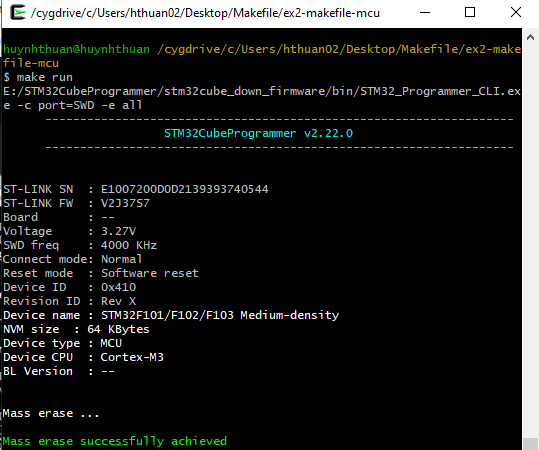


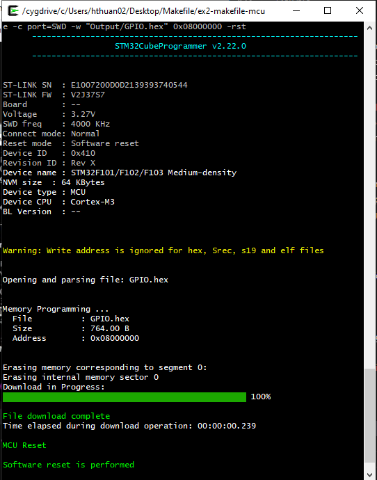

</details>

<details>
  <summary><h3>Lesson 7: Tổng quát hóa 1 (Automatic Variables) </h3></summary>

## I. Automatic Variables

> Các biến tự động, gọi nó ra truy xuất bằng dâu $

```c
main.o: src/main.c
	gcc -c src/main.c -o output/main.o
```

- `$@`: là các tên target trước dấu 2 chấm-output (main.o)

- `$^`: là `prerequisite` sau dấu chấm-intput (src/main.c)

- `$<`: tên đầu tiên của `prerequisite`

```
main.o: src/main.c
	gcc -c $^ -o output/$@
```

```c

#main.o
Output/main.o: User/src/main.c
	$(CC) $(CCFLAGS) -o Output/main.o User/src/main.c
#GPIO.o
Output/GPIO.o: Driver/GPIO/src/GPIO.c
	$(CC) $(CCFLAGS) -o Output/GPIO.o Driver/GPIO/src/GPIO.c 
#startup.o
Output/stm32_startup.o: Startup/stm32_startup.c
	$(CC) $(CCFLAGS) -o Output/stm32_startup.o Startup/stm32_startup.c
	
#GPIO.elf
Output/GPIO.elf: Output/main.o Output/GPIO.o Output/stm32_startup.o
	$(CC) $(LDFLAGS) -o Output/GPIO.elf Output/main.o Output/GPIO.o Output/stm32_startup.o

#GPIO.hex
Output/GPIO.hex: Output/GPIO.elf
	$(GCC_DIR)/arm-none-eabi/bin/objcopy.exe -O ihex "Output/GPIO.elf" "Output/GPIO.hex"
```
#### Sau khi thực hiện Automatic Variables
```c
#main.o
Output/main.o: User/src/main.c
	$(CC) $(CCFLAGS) -o $@ $^
#GPIO.o
Output/GPIO.o: Driver/GPIO/src/GPIO.c
	$(CC) $(CCFLAGS) -o $@ $^ 
#startup.o
Output/stm32_startup.o: Startup/stm32_startup.c
	$(CC) $(CCFLAGS) -o $@ $^
	
#GPIO.elf
Output/GPIO.elf: Output/main.o Output/GPIO.o Output/stm32_startup.o
	$(CC) $(LDFLAGS) -o $@ $^

#GPIO.hex
Output/GPIO.hex: Output/GPIO.elf
	$(GCC_DIR)/arm-none-eabi/bin/objcopy.exe -O ihex "$^" "$@"
```
</details>

<details>
  <summary><h3>Lesson 8: Tổng quát hóa 2 (wildcard-foreach)</h3></summary>


## I. 'wildcard' characters
VD1: Project có nhiều thư viện (nhiều header file): GPIO.h, UART.h

```c
INC_DIRS += Driver/GPIO/inc \ 
			Driver/UART/inc
```

> Để quét tất cả file header trong các đường dẫn -> Dùng từ khóa wildcard

```c
INC_DIRS += Driver/GPIO/inc \
			Driver/UART/inc
INC_FILES = $(wildcard $(INC_DIRS)/*)
#/* lấy tất cả
# Nhưng vẫn còn 1 khuyết điểm, wildcard này chỉ lấy đc file header phần tử cuối cùng là UART.h
# Nếu đổi vị trí GPIO vs UART thì chỉ lấy đc GPIO.h
```

-> Để khắc phục tình trạng trên thì kết hợp đồng thời wildcard-foreach
# II. 'foreach' function

> Giống với vòng lặp for, lướt qua từng phần tử

`$(foreach var, list, text)`

- `foreach var`: dir (đường dẫn)
- `list`: tất cả dir (đường dẫn)
- `text`: wildward

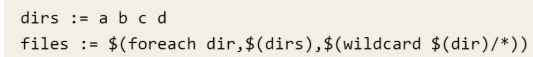

VD:
```c
$(foreach abc,$(INC_DIRS),-I$(abc))
$(foreach dir,$(INC_DIRS),-I$(dir))
$(foreach i,$(INC_DIRS),-I$(i))
```
- abc-abc, dir-dir, i-i: Tên chỗ này đặt tên nào cũng đc miễn 2 bên giống nhau là được.


Dùng `make print-%` để kiểm tra lấy được hết tất cả header file chưa
`make print-INC_FILES`

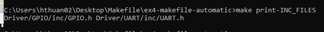

VD2: Project có nhiều file source: GPIO.c, UART.c

```c
#Include Header Files
INC_DIRS += Driver/GPIO/inc \
		 	Driver/UART/inc
INC_FILES += $(foreach z, $(INC_DIRS), $(wildcard $(z)/*))
```
```c
#Include Source Files
SRC_DIRS += Driver/GPIO/src \
		  	Driver/UART/src
SRC_FILES += $(foreach x, $(SRC_DIRS), $(wildcard $(x)/*))
```

- Một vấn đề nhỏ là `-I$` chưa truy xuất tất cả header file

```c
# Include header files
INC_DIRS += Driver/GPIO/inc	\
			Driver/UART/inc 

INC_FILES = $(foreach dir, $(INC_DIRS), $(wildcard $(dir)/*))

# Source files
SRC_DIRS += Driver/GPIO/src \
			Driver/UART/src

SRC_FILES = $(foreach dir, $(SRC_DIRS), $(wildcard $(dir)/*))
```
```c
# Foreach for -I$()
INC_DIR_OPT = $(foreach dir, $(INC_DIRS), -I$(dir))
# Đầu tiên, tạo biến tạm INC_DIR_OPT = -I$(...)
# Sau đó thêm foreach, tên sau foreach đặt gì cũng được 
# Sửa lại chỗ Flags compiler options, chỉ cần truy xuất biến INC_DIR_OPT


# Flags: compiler & linker options
CCFLAGS= -c -mcpu=$(CHIP) -mthumb -std=gnu11 -O0 $(INC_DIR_OPT)
LDFLAGS= -nostdlib -T $(LD_FILE) -Wl,-Map=Output/GPIO.map 
```

</details>

---
# Tạm thời dừng lại ở phần vpath lesson 9. Để học startup file, linker scipt. Hiện không nên đào quá sâu tổng quát hóa makefile


<details>
  <summary><h3>Lesson 9: Tổng quát hóa final ()</h3></summary>

# I. Merge source files

VD: 1 project có rất nhiều peripheral GPIO, UART, DMA, ADC, TIM,... nếu mỗi cái đều mỗi trỏ đường dần để đi tìm từng file.c -> file.o. Rồi tìm từng file.o -> Linking -> file.elf. Sẽ mất rất nhiều thời gian

- `vpath`: cho phép bỏ đi đường dẫn của file.c .h, `vpath` tự động đi tìm source file

```c
vpath %.c $(SRC_DIRS)
vpath %.h $(INC_DIRS)
```
- Bước đầu tiên, xóa hết đầu đường dẫn `prerequisite` -> để lại file.c

```c
# Compile object file
vpath %.c $(SRC_DIRS)

Output/main.o: main.c
	$(CC) $(CCFLAGS) -o $@ $^
Output/GPIO.o: GPIO.c
	$(CC) $(CCFLAGS) -o $@ $^
Output/stm32_startup.o: stm32_startup.c
	$(CC) $(CCFLAGS) -o $@ $^
```

- Sau đó bổ sung tất cả directory vào $(SRC_FILES)

```c
# Source files
SRC_DIRS += Driver/GPIO/src \
			Driver/UART/src \
			User/src		\
			Startup
```


## II. Merge object files
`path rules` có cấu trúc 

```c
%.o: %.c
	recipes...

# 1 file.o thì sẽ được tạo ra từ file.c tương ứng
# Khi làm việc với MCU thì không cần quan tâm đến tên của file main.o
```

```c
# Source files
SRC_DIRS += Driver/GPIO/src \
			Driver/UART/src \
			User/src		\
			Startup

#....

# Compile object file
vpath %.c $(SRC_DIRS)

$(PATH_OUTPUT)/main.o: main.c
	$(CC) $(CCFLAGS) -o $@ $^
$(PATH_OUTPUT)/GPIO.o: GPIO.c
	$(CC) $(CCFLAGS) -o $@ $^
$(PATH_OUTPUT)/UART.o: UART.c
	$(CC) $(CCFLAGS) -o $@ $^
$(PATH_OUTPUT)/stm32_startup.o: stm32_startup.c
	$(CC) $(CCFLAGS) -o $@ $^
	
# Build excutable file
$(PATH_OUTPUT)/GPIO.elf: $(PATH_OUTPUT)/main.o $(PATH_OUTPUT)/GPIO.o $(PATH_OUTPUT)/UART.o $(PATH_OUTPUT)/stm32_startup.o
	$(CC) $(LDFLAGS) -o $@ $^

# Build .hex file
$(PATH_OUTPUT)/GPIO.hex: $(PATH_OUTPUT)/GPIO.elf
	$(OBJ_DIR) -O ihex "$^" "$@"
```

- Gom gọn code file.o


```c
# Source files
SRC_DIRS += Driver/GPIO/src \
			Driver/UART/src \
			User/src		\
			Startup

#....

# Compile object file
vpath %.c $(SRC_DIRS)

# Object files: Used partern rules
%.o: %.c
	$(CC) $(CCFLAGS) -o $(PATH_OUTPUT)/$@ $^
# main.o, cần có đường dẫn(directory)
# main.c, k cần đường dẫn có vpath tự tìm rồi	

# Build excutable file
$(PATH_OUTPUT)/GPIO.elf: $(PATH_OUTPUT)/main.o $(PATH_OUTPUT)/GPIO.o $(PATH_OUTPUT)/UART.o $(PATH_OUTPUT)/stm32_startup.o
	$(CC) $(LDFLAGS) -o $@ $^

# Build .hex file
$(PATH_OUTPUT)/GPIO.hex: $(PATH_OUTPUT)/GPIO.elf
	$(OBJ_DIR) -O ihex "$^" "$@"
```
# III. Excutable file
```c
# Build excutable file
$(PATH_OUTPUT)/GPIO.elf: $(PATH_OUTPUT)/main.o $(PATH_OUTPUT)/GPIO.o $(PATH_OUTPUT)/stm32_startup.o
	$(CC) $(LDFLAGS) -o $@ $^

```
--> Mục đích: Rút ngắn file.o

- `notdir`: Cho phép bỏ đi các đường dẫn, chỉ giữ lại các file
- Có `SRC_FILES` (foreach + wildcard) mới dùng được

VD:
```c
# Source files
SRC_DIRS += Driver/GPIO/src \
			Driver/UART/src \
			User/src		\
			Startup

SRC_FILES = $(foreach dir, $(SRC_DIRS), $(wildcard $(dir)/* ))
# */
# Object files
OBJ_FILES := $(notdir $(SRC_FILES))
```

```c
OBJ_FILES := $(notdir $(SRC_FILES))

# Khi kiểm tra bằng "make print-OBJ_FILES"
# Output: main.c sub.c sum.c
```

- Sau đó dùng hàm print-% để thay duôi file.c thành file.o
```c
# Object files
# Kí tự đầu tiên sau `subst`, là kí tự có trong chuỗi để thay thế
OBJ_FILES := $(notdir $(SRC_FILES))
OBJ_FILES := $(subst .c,.o,$(OBJ_FILES))

# Output: main.o gpio.o startup.o
```

- Sau đó, thêm `$(PATH_OUTPUT)` cho cả 3 file.o -> Dùng `foreach`


</details>